# anaconda-setup-guide
Anaconda installation and setup guides for consultants working with DOT

1. Go to the following website: https://www.anaconda.com/

 
 

2. Click on “Get Additional Installers”:

 
 

3. Download the current version for windows (Python 3.10 64-Bit Graphical Installer):

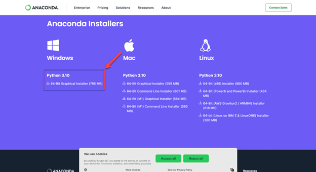

 
 

4.	Run the installation file and click “Next”:

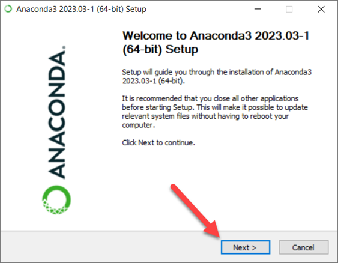

 
 

5.	Click “Agree” in the license agreement window:

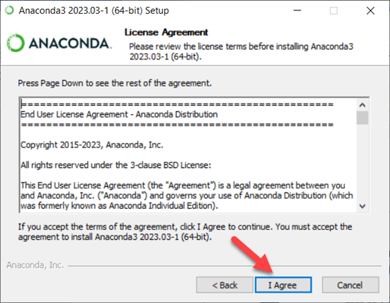

 
 

6.	In the Installation Type section choose the recommended settings and click next:

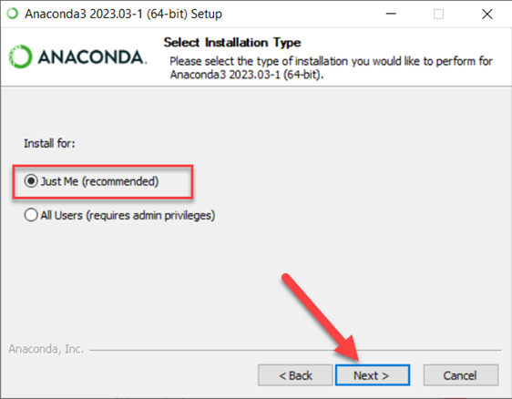

 
 

7.	The default path is recommended, after specifying the installation path click Next:

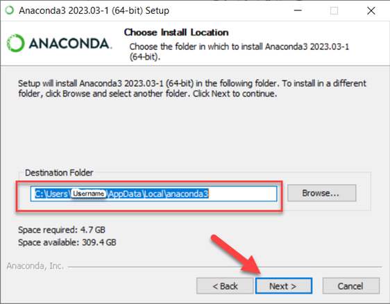

 
 

8.	In the Advanced Installation Options accept the defaults and click install:

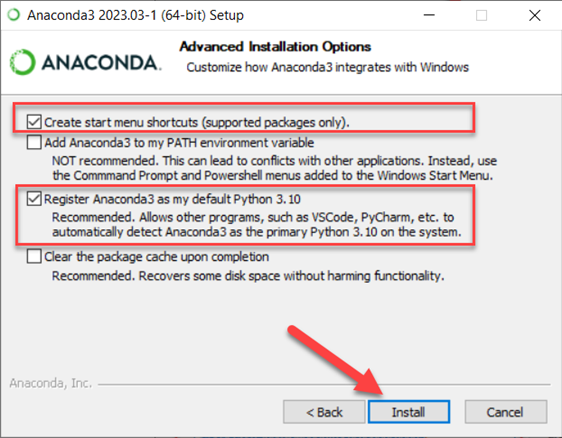

 
 

9.	Continue the next steps and finish the setup:

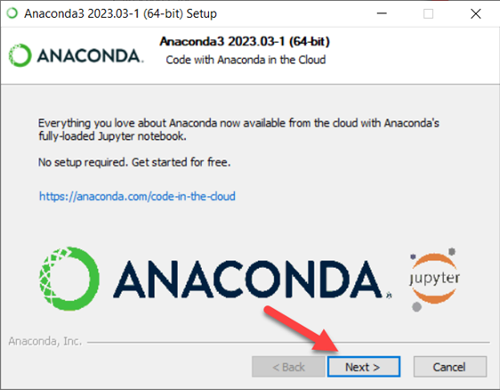

 
 

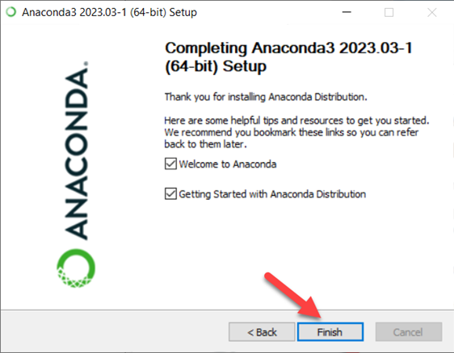

 
 

10.	In the windows search bar, search for “anaconda prompt” and launch the program.

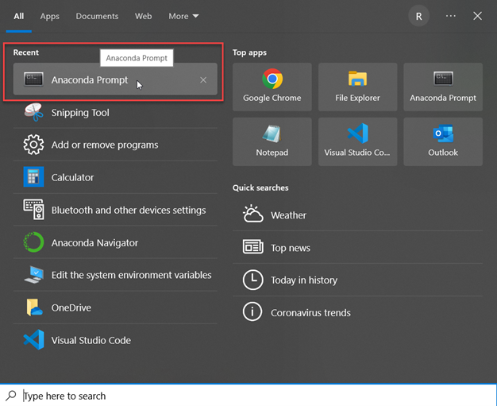

 
 

11.	In the prompt window type the following command to create a new anaconda environment (know more about anaconda environments and how to manage them here: https://conda.io/projects/conda/en/latest/user-guide/concepts/environments.html , https://conda.io/projects/conda/en/latest/user-guide/tasks/manage-environments.html#sharing-an-environment):
* ~ conda create --name FDOTCalcs --clone base.

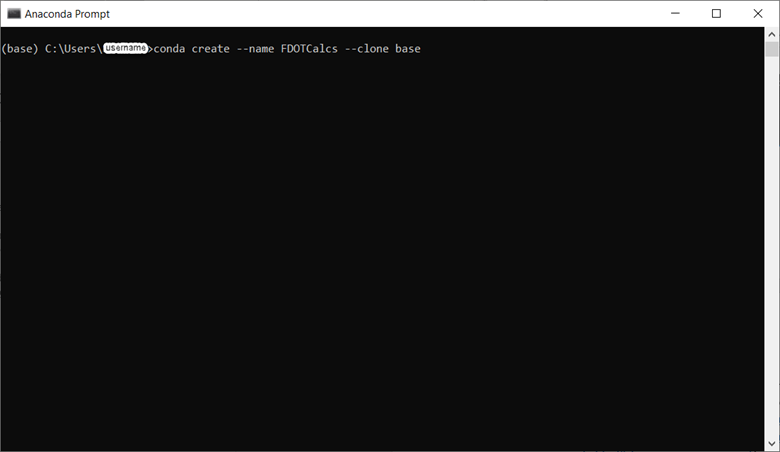

 
 

12.	After the cloning process was complete, switch to the newly created environment (FDOTCalcs) using the following command:	
* ~ conda activate FDOTCalcs

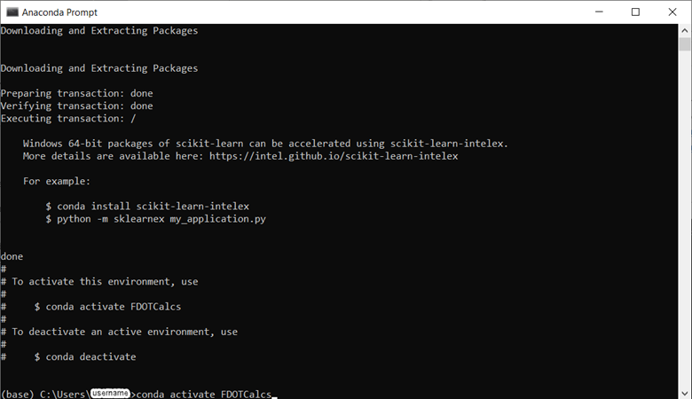

 
 

13.	Assuming the default installation path for Anaconda was accepted (step #7), place the “requirements.txt” file in the “C:\Users\Username” path, where Username is the username under which the Anaconda software was installed.

 
 

14.	Run the following command to install the required packages for FDOT calculation sheets in this newly created environment from the “requirements.txt” file:
* ~ pip install -r requirements.txt
 
 
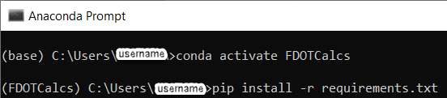

 
 

15.	After installation is successful, launch Jupyter lab program by typing the following command, make your browser Google Chrome as the default program when launching Jupyter Lab for the first time:
* ~ jupyter lab
 
 
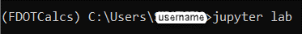 
 
 
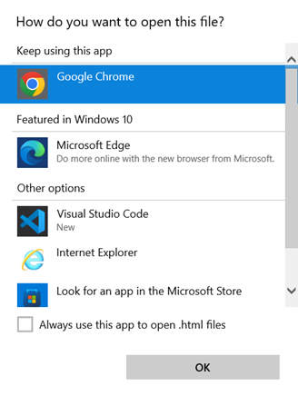